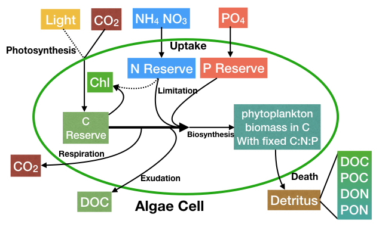

# Summary
`PlanktonIndividuals.jl` is a fast individual-based model that represents the phytoplankton life cycle in detail, is written in Julia, and runs on both CPU and GPU. It simulates the life cycle of phytoplankton cells as Lagrangian particles while nutrients are represented as Eulerian tracers taking the advantage of both type of models in one framework. 

The model is used to elucidate temporal and spatial variations in phytoplankton cell density, stoichiometry, as well as growth and division behaviors induced by diel cycle and physical motions ranging from sub-mesoscale to large scale processes. The phytoplankton physiology model is state of the art \autoref{fig:phyto} with the widely-used Droop model [@Droop1973] implemented for nutrient uptakes. The photosynthesis formulation by Geider et al [@geider1997dynamic] is also implemented for carbon fixation. Additionally, exudation and mixotrophy are also accounted for in the model [@wu2021modeling].

`PlanktonIndividuals.jl` can simulate multiple functional groups of phytoplankton with different growth and division strategies which will illustrate the interactions within and between functional groups. The individuals can be simulated not only in a zero-dimensional domain (like lab experiments) but also in one-, two-, or three-dimensional domains where individuals can be advected by velocities provided by various models or observations (e.g. `MITgcm`, `Oceananigans.jl`).

# Statement of need
Phytoplankton models, like those incorporated in ecological and biogeochemical models, are essential tools to explore and understand phytoplankton life cycles, interactions between species, population dynamics, and community structures in various water bodies (e.g. lakes, coastal waters, and open ocean) [@follows2007emergent; @geider1997dynamic]. Individual-based / Lagrangian models differ from Eulerian (population level) models in the way they represent heterogeneous populations like cells of different sizes, nutrient quotas, and life cycle stages [@hellweger2016advancing; @hellweger2014biogeographic; @clark2011individual]. 

The unique power of individual-based modeling lies in the ability to track the position, biomass, and physiological state of individual cells, or plankton patches, as they move through space over time. Eulerian models in turn can only track the density of plankton biomass in “well-mixed” grids of simulated waterbody. Furthermore, individual-based models are able to introduce randomness in individuals which allows stochastic processes (e.g. cell division, grazing, death etc.) to reproduce the diversity found in real ecosystems.

Due to computational limitations, previous microbial individual-based models could only simulate a limited number of individuals, with each individual representing cell populations rather than individual cells [@hellweger2016advancing]. In order to overcome this obstacle, `PlanktonIndividuals.jl` exploits the power of Graphical Processing Units (GPUs) which were first developed for video rendering but now offer extremely efficient, highly parallelized computing power. With GPU support, the simulations in `PlanktonIndividuals.jl` are sped up for over 50 times compared with CPU simulations.

There are many software packages for individual-based modeling, both in Julia or other programming languages, aimed at different purposes. For example, `Netlogo` [@NetLogo1999] and `Agents.jl` [@Agents2021] provide generic agent-based frameworks -- with a focus on generality. In contrast, `oceanParcels` [@gmd-10-4175-2017] and `IndividualDisplacements.jl` [@Forget2021] focus on the Lagrangian simulation of individual displacements in the ocean and climate system. However, we do not know of a framework that would provide the same features as `PlanktonIndividuals.jl`.

Our package is unique in the way that it is taylored to the analysis of marine ecosystems across a wide range of scales using HPC systems. To this end, `PlanktonIndividuals.jl` provides a comprehensive description of phytoplankton physiology and biogeochemistry, written in a fast language, Julia, and with GPU support. It further innovates in combining the Eulerian and Lagrangian perspectives. Plankton individuals (Lagrangian) indeed have a two-way interactions with gridded nutrient fields (Eulerian) that are advected by the same flow fields (in 2D or 3D) in our package. 

Further development plans include implementation of macro-molecular model [@Inomura2020] and support for distributed parallelism with CUDA-aware MPI.

