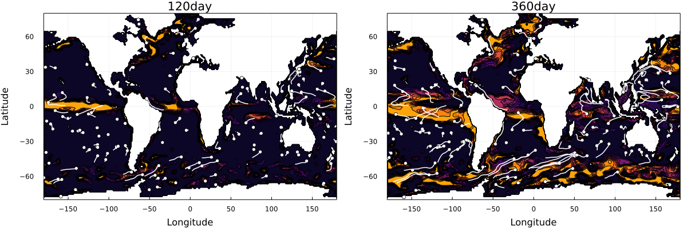

# Summary
Marine phytoplankton contributes ~50% of the total primary production on Earth forming the basis of the food web in the oceans. Understanding the spatial distribution and temporal variations of the phytoplankton community is essential to the global carbon and nutrient cycles. `PlanktonIndividuals.jl` is a fast individual-based model that represents the phytoplankton life cycle in detail, is written in Julia, and runs on both CPU and GPU. The model is used to elucidate temporal and spatial variations in phytoplankton cell density and stoichiometry, as well as growth and division behaviors induced by diel cycle and physical motions ranging from sub-mesoscale to large scale processes. 

`PlanktonIndividuals.jl` can simulate multiple functional groups of phytoplankton with different growth and division strategies which will illustrate the interactions within and between functional groups. It simulates phytoplankton cells as Lagrangian particles while nutrients are represented as Eulerian tracers taking the advantage of both types of models in one framework, where Eulerian simulations employ a fixed mesh while Lagrangian ones feature individual fluild parcels that may move following the velocity field.

The equations included in `PlanktonIndividuals.jl` to describe phytoplankton physiology are state of the art (\autoref{fig:phyto}) with the widely-used Droop model [@Droop1973] implemented for nutrient uptakes. The photosynthesis formulation by Geider et al [@geider1997dynamic] is also implemented for carbon fixation. Additionally, exudation and mixotrophy are also accounted for in the model [@wu2021modeling]. Both simulated phytoplankton cells and nutrient tracers are advected by the same velocity field provided externally. The growth rate and nutrient uptake rates of each simulated cells are decided by the nutrient availability, light intensity, and temperature at the position of the simulated cell. And in turn, the nutrient consumed or released by phytoplankton cells are added to (or subtracted from) the nutrient fields at the grid point the cells are in. The simulations can be set up not only in a zero-dimensional domain (like lab experiments) but also in one-, two-, or three-dimensional domains. The external inputs required by the package include velocity fields, temperature fields, and surface photosynthetically active radiation (PAR) fields.  Our package is able to use velocity and temperature fields provided by different fluid dynamic models (e.g. `Oceananigans.jl`, `MITgcm`, etc.) and observations. Two default parameter sets are inclued in the package, biogeochemical parameters of nutrient tracers, and phytoplankton physiological parameters for individual phytoplankton cells. These parameters can be varied to simulate different phytoplankton species and biogeochemistry. The outputs of `PlanktonIndividuals.jl` include time series of individual trajectories, cell density, biomass, and vital rates such as cell division rates, photosynthesis rate, and nutrient uptake rates (\autoref{fig:0D}).

# Statement of need
Phytoplankton models, like those incorporated in ecological and biogeochemical models, are essential tools to explore and understand phytoplankton life cycles, interactions between species, population dynamics, and community structures in various water bodies (e.g. lakes, coastal waters, and open ocean) [@follows2007emergent; @geider1997dynamic]. Individual-based / Lagrangian models differ from Eulerian (population level) models in the way they represent heterogeneous populations like cells of different sizes, nutrient quotas, and life cycle stages [@hellweger2016advancing; @hellweger2014biogeographic; @clark2011individual]. 

The unique power of individual-based modeling lies in the ability to track the position, biomass, and physiological state of individual cells or plankton patches, as they move through space over time. Eulerian models in turn can only track the density of plankton biomass in “well-mixed” grids of simulated water bodies. Furthermore, individual-based models are able to introduce randomness in individuals which allows stochastic processes (e.g. cell division, grazing, death etc.) to reproduce the diversity found in real ecosystems.

Due to computational limitations, previous microbial individual-based models could only simulate a limited number of individuals, with each individual representing cell populations rather than individual cells [@hellweger2016advancing]. In order to overcome this obstacle, `PlanktonIndividuals.jl` exploits the power of Graphical Processing Units (GPUs) which were first developed for video rendering but now offer extremely efficient, highly parallelized computing power. With GPU support, the simulations in `PlanktonIndividuals.jl` are sped up over 50 times compared with CPU simulations.

There are many software packages for individual-based modeling, both in Julia or other programming languages, aimed at different purposes. For example, `Netlogo` [@NetLogo1999] and `Agents.jl` [@Agents2021] provide generic agent-based frameworks -- with a focus on generality but lack of physical and biogeochemical equations, which are the core of `PlanktonIndividuals.jl`. In contrast, `oceanParcels` [@gmd-10-4175-2017] and `IndividualDisplacements.jl` [@Forget2021] focus on the Lagrangian simulation of individual displacements in the ocean and climate system. However, these packages mainly focus on simulation of passive particles (e.g. water parcels) and do not include equations of phytoplankton physiology.

Our package is unique in the way that it is tailored to the analysis of marine ecosystems across a wide range of scales using HPC systems. To this end, `PlanktonIndividuals.jl` provides a comprehensive description of phytoplankton physiology and biogeochemistry, written in a fast language, Julia, and with GPU support. It further innovates in combining the Eulerian and Lagrangian perspectives. Plankton individuals (Lagrangian) indeed have a two-way interactions with gridded nutrient fields (Eulerian) that are advected by the same flow fields (in 1D, 2D or 3D) in our package. 

To illustrate advective processes, we performed a one-year simulation of a passive tracer, initialized to a concentration of 1 below 50m depth and 0 above 50m depth, along with 512 particles moving in three dimensions (\autoref{fig:3D}).

Further development plans include implementation of macro-molecular model [@Inomura2020] and support for distributed parallelism with CUDA-aware MPI.

# Acknowledgements

We acknowledge contributions from the open source community at large, the paper reviewers and journal editor, as well as developers of `Julia` and its packages upon which `PlanktonIndividuals.jl` crucially depends. 

Funding that supported this work was provided by the Simons Collaboration on Computational Biogeochemical Modeling of Marine Ecosystems (CBIOMES) (grant no. 549931) and Simons Collaboration on Ocean Processes and Ecology (SCOPE) (grant no. 329108). GF was additionally funded by National Aeronautics and Space Administration award 19-PO19-0001 (NNH19ZDA001N-PO) and 19-MAP19-0018 (NNH19ZDA001N-MAP).

# References
