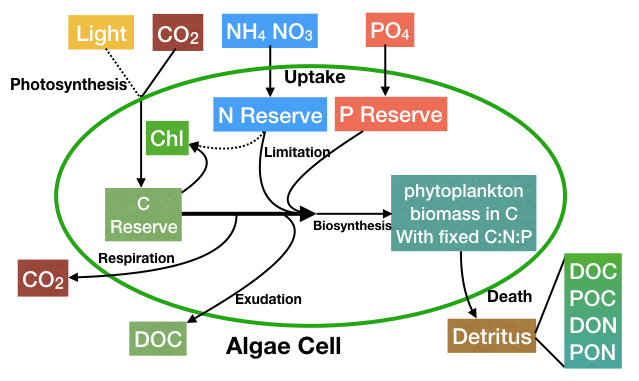

# parameterization of phytoplankton physiology



## Photosynthesis

Basically, we follow Geider et al. 1998 for the parameterization of photosynthesis, but without nutrient limitation.

```math
PP=PP_{max}\cdot (1-e^{\frac{-\alpha \cdot I\cdot Chl}{PP_{max}\cdot C}})
```
**Unit: mmolC/cell/s**
``PP_{max}`` is scaled by a power-law relationship of cell size


## Nutrient Uptake

Include intracellular nutrient limitation:
```math
RegQ_i=\bigg[\frac{R_{iC}^{max}-Q_i}{R_{iC}^{max}-R_{iC}^{min}}\bigg]_0^1\\
V_i=V_i^{max}\cdot regQ_i\cdot\frac{[i]}{[i]+K_i^{sat}}
```
``i`` denotes ``NH_4``, ``NO_3``, ``PO_4``.
**Unit: mmolN/cell/s**


## Biosynthesis & Excretion
### Update reserves:

```math
Q_C^R = Q_C^R+PP\\
Q_N^R=Q_N^R+V_{NO_3}+V_{NH_4}\\
Q_P^R=Q_P^R+V_{PO_4}\\
```

### Metabolic Partitioning
```math
\beta=\frac{a\cdot Vol_{cell}^b}{1+a\cdot Vol_{cell}^b}\\
BioSynC = \beta\cdot k_{mtb}\cdot Q_C^R\\
MaintenC=(1-\beta)\cdot k_{mtb}\cdot Q_C^R\\
```

```math
BioSynN = k_{mtb}\cdot Q_N^R/R_{NC}\\
BioSynP = k_{mtb}\cdot Q_P^R/R_{PC}
```

### Compute biosynthesis rate and excretion rate
```math
BioSyn=min(BioSynC,BioSynN,BioSynP)\\
ExcretC=BioSynC - BioSyn\\
```

### Update reserves and biomass
```math
Q_C^B = Q_C^B + BioSyn\\
Q_C^R = Q_C^R - BioSyn - MaintenC\\
Q_N^R = Q_N^R - BioSyn*R_{NC}\\
Q_P^R = Q_N^R - BioSyn*R_{PC}\\
```
